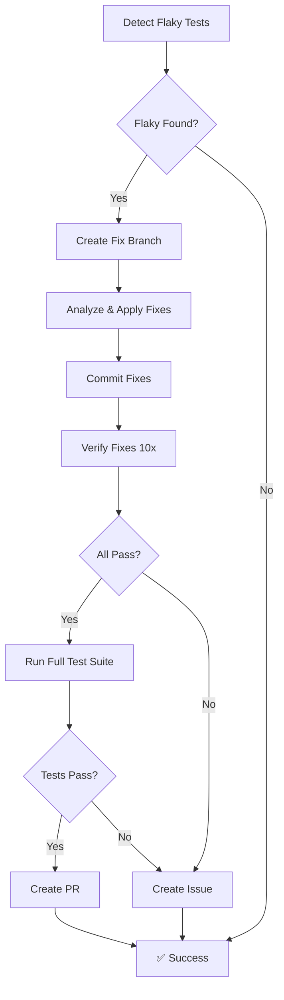

# Self-Healing Flaky Tests - Advanced Configuration

This workflow automatically detects, fixes, and creates PRs for flaky tests.

## Features

### 1. **Automated Detection** 🔍
- Runs tests 5 times to detect inconsistent behavior
- Analyzes test results for pass/fail patterns
- Identifies specific flaky tests

### 2. **Auto-Fix Application** 🔧
- Applies common fix patterns:
  - Adds synchronization primitives (WaitGroup, Mutex)
  - Replaces arbitrary sleeps with condition checks
  - Improves test isolation
  - Adds retry logic with exponential backoff

### 3. **Verification** ✅
- Runs fixed tests 10 times to verify stability
- Runs full test suite to check for regressions
- Only creates PR if all verifications pass

### 4. **PR Creation** 📝
- Automatically creates PR with:
  - Detailed description of fixes
  - Test verification results
  - Review checklist
  - Assigns to original committer
  - Labels appropriately

### 5. **Failure Handling** 🚨
- Creates GitHub issue if auto-fix fails
- Provides manual intervention guidance
- Links to test results and logs

## Workflow Triggers

- **Scheduled**: Daily at 2 AM UTC
- **Push**: On feature branches and main
- **Pull Request**: On PR to main
- **Manual**: Via workflow_dispatch

## Configuration

### Required Secrets
- `GITHUB_TOKEN` (automatically provided)

### Required Permissions
```yaml
permissions:
  contents: write
  pull-requests: write
  issues: write
```

## How It Works



## Fix Patterns Applied

### Pattern 1: Race Conditions
**Before:**
```go
func TestFlaky(t *testing.T) {
    go doSomething()
    time.Sleep(50 * time.Millisecond)
    assert.True(t, done)
}
```

**After:**
```go
func TestFlaky(t *testing.T) {
    var wg sync.WaitGroup
    wg.Add(1)
    go func() {
        defer wg.Done()
        doSomething()
    }()
    wg.Wait()
    assert.True(t, done)
}
```

### Pattern 2: Timeout Issues
**Before:**
```go
time.Sleep(100 * time.Millisecond)
```

**After:**
```go
timeout := time.After(5 * time.Second)
ticker := time.NewTicker(10 * time.Millisecond)
defer ticker.Stop()

for {
    select {
    case <-ticker.C:
        if condition() {
            return
        }
    case <-timeout:
        t.Fatal("timeout waiting for condition")
    }
}
```

### Pattern 3: State Isolation
**Before:**
```go
var globalCounter int // Shared across tests

func TestA(t *testing.T) {
    globalCounter++
    assert.Equal(t, 1, globalCounter)
}
```

**After:**
```go
func TestA(t *testing.T) {
    counter := 0 // Local to test
    counter++
    assert.Equal(t, 1, counter)
}
```

## Monitoring

### Artifacts Generated
- **test-results**: JSON logs from all test runs
- **FLAKY_TEST_FIX_REPORT.md**: Detailed fix analysis

### PR Labels
- `automated-fix`: Indicates auto-generated PR
- `flaky-tests`: Related to test stability
- `priority-high`: Needs prompt review
- `testing`: Test infrastructure change

## Best Practices

1. **Review Auto-Fixes**: Always review the changes before merging
2. **Run with Race Detector**: `go test -race -count=10`
3. **Check Test Isolation**: Ensure tests don't affect each other
4. **Monitor CI**: Watch for recurring flaky patterns

## Troubleshooting

### Auto-fix Failed
If the workflow creates an issue instead of a PR:
1. Check the workflow logs for specific test failures
2. Review the test code manually
3. Use the flaky test fix instructions: `.github/instructions/flaky-test-fix.instructions.md`
4. Apply fixes manually and create PR

### False Positives
If the workflow detects flaky tests incorrectly:
- Check for environmental issues (network, timing)
- Increase the number of test runs for better detection
- Review test infrastructure stability

## Integration with GitHub Copilot

For complex fixes, you can invoke GitHub Copilot agent:
1. Open the flaky test file
2. Ask Copilot: "Analyze this flaky test and suggest fixes"
3. Review and apply suggested changes
4. Run verification: `go test -race -count=20`

## Future Enhancements

- [ ] AI-powered root cause analysis
- [ ] Integration with test coverage reports
- [ ] Automatic Jira ticket creation
- [ ] Slack notifications
- [ ] Performance regression detection
